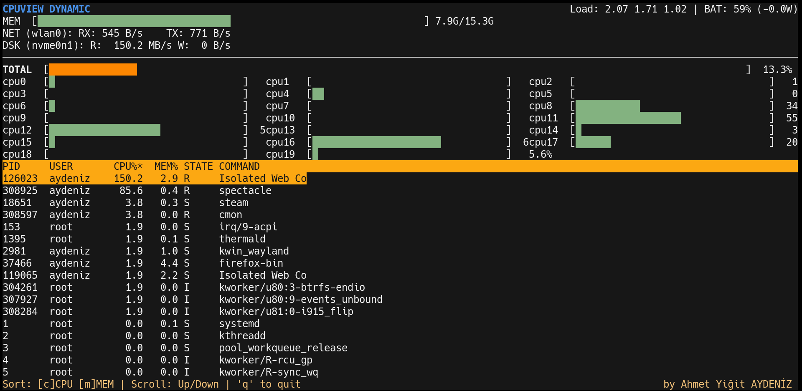

# cmon 📊

> A lightweight, dynamic terminal system monitor written in C.



`cmon` (C-Monitor) is a fast, low-footprint system monitor that gives you a real-time, responsive overview of your machine's vital statistics straight from the terminal.

## Features

*   **Per-Core CPU Monitoring:** Visualize individual core usage dynamically.
*   **Memory Usage:** Responsive memory bar tracking RAM utilization.
*   **Network & Disk I/O:** Real-time throughput statistics for your primary network interface and storage drive.
*   **Low Footprint:** Written purely in C using `ncurses` for minimal system overhead.
*   **Responsive UI:** Adapts to your terminal window size automatically.

## Installation

### The Quick Way (Recommended)
You can install `cmon` directly using this one-liner (replace `yourusername` with your actual GitHub username after pushing):

```bash
curl -sSL https://raw.githubusercontent.com/yourusername/cmon/main/install.sh | bash
```

### Manual Build
If you prefer to build it yourself:

**1. Install Dependencies**
*   **Debian/Ubuntu:** `sudo apt install build-essential libncursesw5-dev`
*   **Arch Linux:** `sudo pacman -S base-devel ncurses`
*   **Fedora/Bazzite:** `sudo dnf install gcc make ncurses-devel`

**2. Build and Install**
```bash
git clone https://github.com/yourusername/cmon.git
cd cmon
make
sudo mv cmon /usr/local/bin/
```

## Usage

Simply run the compiled executable:

```bash
./cmon
```

**Controls:**
*   Press `q` to quit the application.

## License

MIT License
